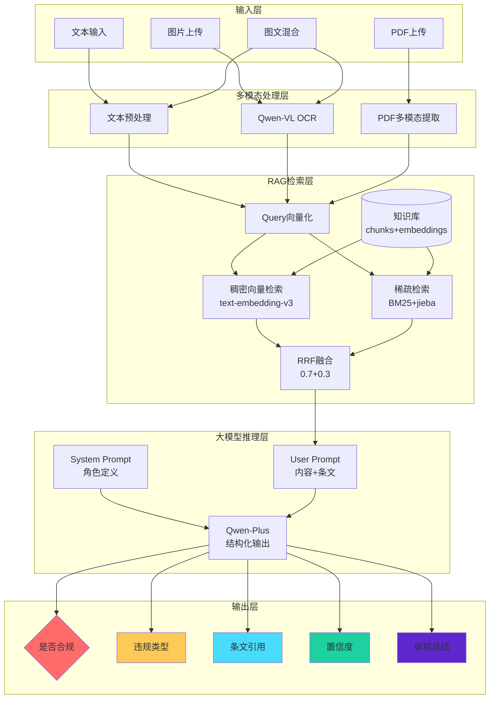
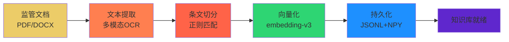
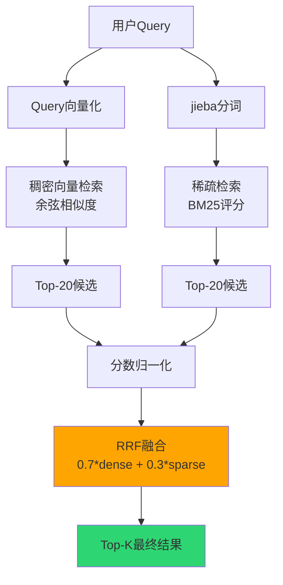
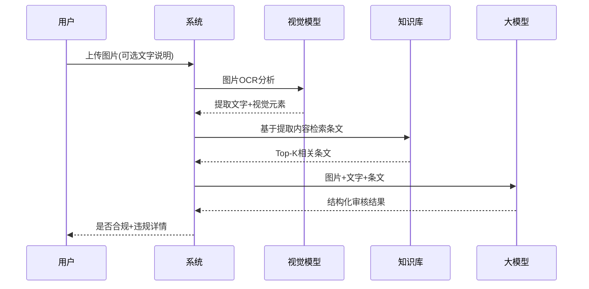

# 保险营销内容智能审核系统 - 技术架构详解

## 一、Mermaid架构图

### 1.1 整体系统架构



### 1.2 知识库构建流程



### 1.3 混合检索算法流程



### 1.4 多模态审核流程



---

## 二、核心算法详解

### 2.1 RRF (Reciprocal Rank Fusion) 融合算法

```
算法思想：
不同检索方法得到的分数量纲不同，直接相加不合理
RRF通过排名进行融合，消除分数量纲差异

实现步骤：
1. 分别计算稠密检索和稀疏检索的分数
2. 对分数进行归一化：score_norm = (score - min) / (max - min)
3. 加权融合：fusion_score = w_dense * score_dense + w_sparse * score_sparse
4. 按融合分数排序，返回Top-K

权重设置：
- dense_weight = 0.7（语义理解更重要）
- bm25_weight = 0.3（精确匹配补充）
```

### 2.2 向量检索原理

```
使用余弦相似度衡量文本相似度：

similarity = cos(A, B) = (A · B) / (||A|| × ||B||)

其中：
- A: 查询向量 (1024维)
- B: 知识库向量 (1024维)
- ||A||: 向量模长

归一化后简化为：
similarity = A_norm · B_norm
```

### 2.3 BM25算法

```
BM25是一种概率检索函数，用于估算文档与查询的相关性：

score(D,Q) = Σ IDF(qi) × (f(qi,D) × (k1 + 1)) / (f(qi,D) + k1 × (1 - b + b × |D|/avgdl))

参数说明：
- qi: 查询中的第i个词
- f(qi,D): 词qi在文档D中的词频
- |D|: 文档长度
- avgdl: 平均文档长度
- k1: 词频饱和参数 (默认1.2)
- b: 长度惩罚参数 (默认0.75)

本项目使用jieba分词 + rank-bm25库实现
```

---

## 三、数据流详解

### 3.1 知识库数据结构

```
kb/
├── chunks.jsonl          # 条文块数据
│   └── 每行格式：
│   {
│     "source_file": "保险销售行为管理办法.pdf",
│     "clause_id": "第十五条",
│     "clause_text": "保险公司..."
│   }
│
├── embeddings.npy        # 向量矩阵 (n_chunks, 1024)
│   └── dtype: float32
│
└── meta.json            # 元数据
    {
      "created_at": "2025-xx-xx",
      "num_chunks": 123,
      "embedding_model": "text-embedding-v3"
    }
```

### 3.2 审核结果JSON结构

```json
{
  "is_compliant": "no",
  "violations": [
    {
      "type": "夸大收益",
      "clause_id": "第十五条",
      "clause_text": "不得有保证收益...",
      "reason": "文案中承诺8%保证收益，违反相关规定",
      "confidence": 0.95
    }
  ],
  "overall_confidence": 0.92,
  "summary": "该营销文案承诺保本保收益，存在夸大收益的违规行为",
  "retrieved_rules": [...],
  "raw_model_output": "..."
}
```

---

## 四、关键配置参数

| 参数 | 默认值 | 说明 |
|------|--------|------|
| `top_k` | 6 | 检索返回的相关条文数量 |
| `max_chunk_chars` | 700 | 条文最大字符数，超过则分片 |
| `temperature` | 0.0 | LLM温度，0保证输出稳定 |
| `bm25_weight` | 0.3 | BM25检索权重 |
| `dense_weight` | 0.7 | 向量检索权重 |
| `embedding_dim` | 1024 | 向量维度 |

---

## 五、性能指标

### 5.1 评估指标

| 指标 | 数值 | 说明 |
|------|------|------|
| 准确率 | 100% | 测试集4/4正确 |
| 检索延迟 | <500ms | 向量检索时间 |
| 总体延迟 | 2-5s | 包含LLM推理 |
| 知识库大小 | ~1MB | 3个监管文档 |

### 5.2 成本估算（阿里云百炼）

| 操作 | 模型 | 单价 | 估算 |
|------|------|------|------|
| 文本审核 | qwen-plus | ¥0.004/1k tokens | ~¥0.01/次 |
| 图片审核 | qwen-vl-plus | ¥0.02/次 | ~¥0.02/次 |
| 向量化 | text-embedding-v3 | ¥0.0007/1k tokens | 可忽略 |

---

## 六、扩展方向

### 6.1 功能扩展
- [ ] 支持视频审核（提取关键帧+语音识别）
- [ ] 支持音频审核（语音识别+文本审核）
- [ ] 批量审核并发处理
- [ ] 审核历史记录与分析
- [ ] 风险等级评分系统

### 6.2 性能优化
- [ ] 使用Milvus生产级向量数据库
- [ ] Redis缓存常见查询结果
- [ ] 异步批量审核
- [ ] 检索结果缓存

### 6.3 模型优化
- [ ] 微调embedding模型（金融领域）
- [ ] Prompt优化（少样本学习）
- [ ] 使用更强的模型（qwen-max）
